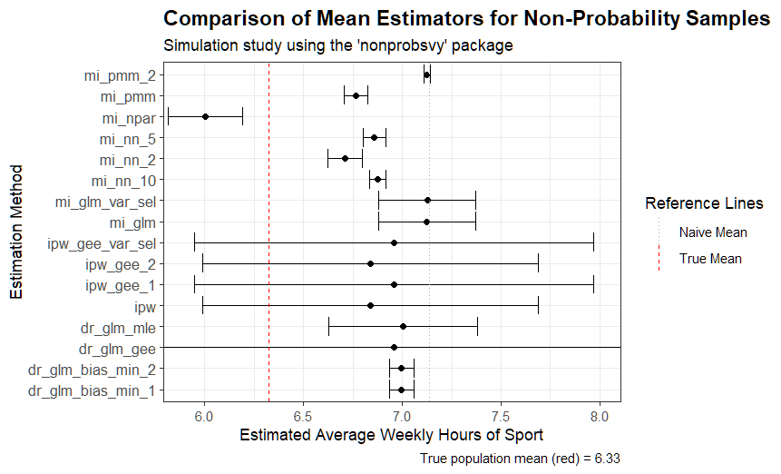

# Verification of Estimators for Non-Probability Samples in R

In this project I investigated the concepts of `nonprobsvy` library to check how different estimators behave. There is a simulation of a population where weekly time spent on sport activities depends on sex, BMI and age. From this population a non-probability and a probability sample are drawn. Then various estimators provided by `nonprobsvy` library (IPW, MI, DR) are used to estimate average weekly time spent on sport. Finally all estimates were presented on the graph and compared to the true mean.

## Motivation

The `nonprobsvy` library was created to implement solutions to the non-probability samples problem. For example, suppose we have an online survey and want to estimate a parameter for the whole population based on it. Most likely, a majority of the answers would be given by young people, and older people would be underrepresented in our sample. If only we have some external, unbiased data containing variables that are correlated with our outcome of interest, we can use the tools from the `nonprobsvy` library to correct for this bias.

I created this project because I want to understand the basics of the non-probability samples problem and to prepare for applying for an internship in a project developing the `nonprobsvy` library. This work is based on the article "nonprobsvy – An R package for modern methods for non-probability surveys" by M. Beręsewicz, P. Chlebicki, and Ł. Chrostowski.

## Key Results

The simulation highlights a significant bias-variance tradeoff. While most methods successfully reduce the bias of the naive estimator, their precision and accuracy vary considerably. Methods based on outcome modeling (MI) generally proved more stable than weighting-based methods (IPW) in this specific setup. The full comparison plot is presented below.

## Full Analysis and Code

For a detailed, step-by-step breakdown of the methodology, data generation process, full results, and complete source code, please see the full analytical report.

➡️ **[View the Full Analytical Report](Nonprob_Simulation_Analysis.md)**

---

## How to Run

1.  Clone this repository.
2.  Open the `Application of nonprobsvy.Rproj` file in RStudio.
3.  Install the required packages: `install.packages(c("tidyverse", "nonprobsvy", "survey"))`.
4.  To reproduce the full analysis, open and "Knit" the `Nonprob_Simulation_Analysis.Rmd` file.

## Note on AI Assistance

This project was developed with the use of AI-powered language models as a tool for debugging, language editing, and as a sparring partner for discussing statistical concepts. The core design of the simulation, the implementation of the code, and the final analysis and conclusions are the author's own work.
